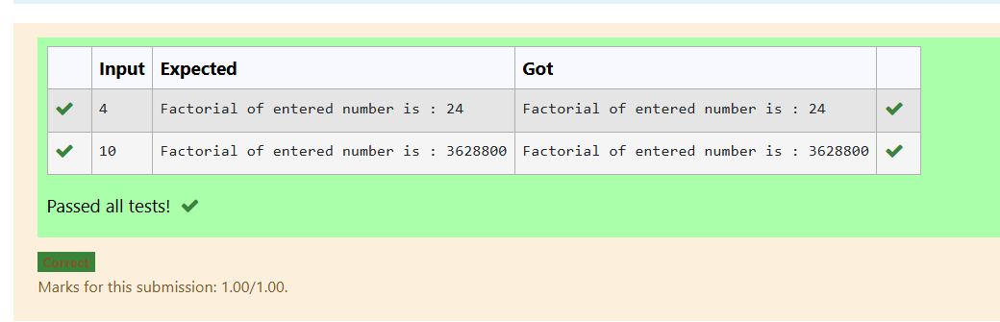
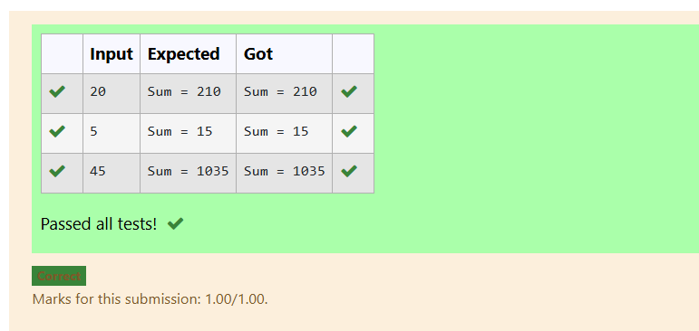
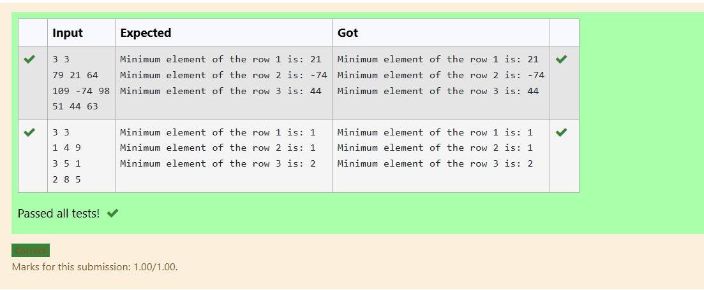
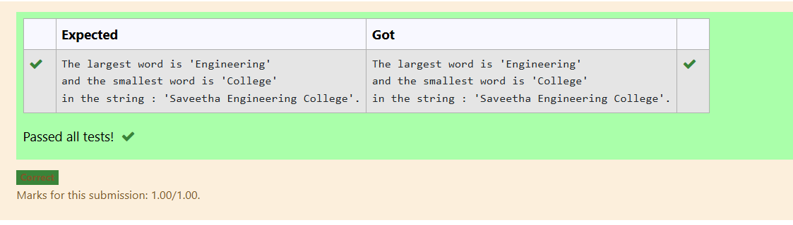
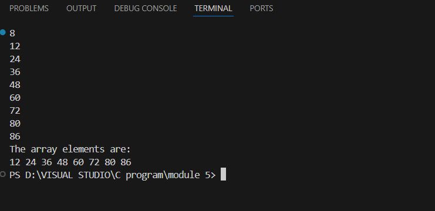

EX-21-POINTERS
# AIM:
write a c program to find factorial of the number  '4' using pointer:

## ALGORITHM:
1.	Start the program.

2. Declare integer variables num, fact, i, and a pointer p.

3. Read the value of num from the user and assign its address to pointer p.

4. Initialize fact = 1 and use a for loop from i = 1 to *p to calculate factorial (fact = fact * i).

5. Print the factorial of the entered number and stop the program.

## PROGRAM:
```
#include <stdio.h>

int main() {
    int num, fact = 1, i;
    int *p;
    scanf("%d", &num);
    p = &num;
    for(i = 1; i <= *p; i++) {
        fact = fact * i;
    }
    printf("Factorial of entered number is : %d", fact);
    return 0;
}
```
## OUTPUT:
 	


## RESULT:
Thus, the program to find the factorial of a given number using pointer has been executed successfully.
 
 


# EX-22-FUNCTIONS AND STORAGE CLASS

## AIM:

Write a C program to calculate the sum of Natural Numbers using Recursion

## ALGORITHM:

1. Start the program.

2. Read an integer n from the user.

3. Define a recursive function sum(n) that returns 0 if n == 0, otherwise returns n + sum(n - 1).

4. Call the function sum(n) from main() and store the result in sum1.

5. Print the value of sum1 as the sum of first n natural numbers.
## PROGRAM:
```
#include<stdio.h>
int sum(int n){
    if(n==0){
        return 0;
    }
    return n+sum(n-1);
}
int main(){
    int n;
    scanf("%d",&n);
    int sum1= sum(n);
    printf("Sum = %d",sum1);
    return 0;
}
```
## OUTPUT:

         		
## RESULT:

Thus, the program to find the sum of first ‘n’ natural numbers using recursion has been executed successfully.
 
 


# EX-23-ARRAYS AND ITS OPERATIONS

## AIM:

Write a C Program to find the minimum element in each row of a matrix

## ALGORITHM:

1.	Start the program.

2. Read the number of rows r and columns c from the user.

3. Declare a 2D array a[r][c] and read all its elements using nested loops.

4. For each row, initialize min with the first element and compare it with all elements in that row to find the smallest value.

5. Print the minimum element of each row.

## PROGRAM:
```
#include <stdio.h>
int main(){
    int r,c,i,j;
    scanf("%d%d", &r, &c);
    int a[r][c];
    
    for(i=0; i<r; i++){
        for(j=0; j<c; j++){
            scanf("%d", &a[i][j]);
        }
    }
    
    for(i=0; i<r; i++){
        int min = a[i][0]; // assum first is smallest
        for(j=0; j<c; j++){
            if(a[i][j] < min)
                min = a[i][j];
        }
        printf("Minimum element of the row %d is: %d\n", i+1, min);
    }
}
```


## OUTPUT


 
 

 ## RESULT
 Thus, the program to find the minimum element in each row of a matrix has been executed successfully.


# EX-24-STRINGS

## AIM:

Write a program in C to find the largest and smallest word in a string "Saveetha Engineering College"..

## ALGORITHM:

1.	Start the program and initialize the string str with "Saveetha Engineering College".

2. Declare character arrays word, smallest, and largest to store temporary, smallest, and largest words.

3. Traverse the string character by character, extracting each word separated by spaces.

4. Compare each extracted word’s length with the current smallest and largest words, updating them when necessary.

5. After traversing the string, display the smallest and largest words found in the given string.

## PROGRAM:
```
#include <stdio.h>
#include <string.h>

int main() {
    char str[200] = "Saveetha Engineering College";
    char word[50];
    char smallest[50];
    char largest[50];
    int i = 0, j = 0, len;


    smallest[0] = '\0';
    largest[0] = '\0';
    word[0] = '\0';

    len = strlen(str);

    while (i <= len) {
        if (str[i] != ' ' && str[i] != '\0') {
            word[j++] = str[i];
        } else {
            word[j] = '\0';  
            if (j > 0) {     
                if (smallest[0] == '\0' || strlen(word) < strlen(smallest))
                    strcpy(smallest, word);
                if (largest[0] == '\0' || strlen(word) > strlen(largest))
                    strcpy(largest, word);
            }
            j = 0; 
        }
        i++;
    }

    printf("The largest word is '%s'\n", largest);
    printf("and the smallest word is '%s'\n", smallest);
    printf("in the string : '%s'.\n", str);

    return 0;
}
```

 ## OUTPUT

 

## RESULT
Thus, the program to find the smallest and largest word in a given string has been executed successfully.
 

 
.


# EX -25 –DISPLAYING ARRAYS USING POINTERS
## AIM

Write a c program to read and display an array of any 6 integer elements using pointer

## ALGORITHM
Step 1: Start the program.

Step 2: Declare the following:
• Integer variable i for iteration.
• Integer variable n to store the number of elements.
• Integer array arr[10] to hold up to 10 elements.
• Integer pointer parr and initialize it to point to the array arr.

Step 3: Read the value of n (number of elements) from the user.

Step 4: Loop from i = 0 to i < n: • Read an integer value and store it in the address parr + i using pointer arithmetic.

Step 5: Loop from i = 0 to i < n: • Print the element at *(parr + i) using pointer dereferencing. 

Step 6: End the program.

## PROGRAM
```
#include <stdio.h>
int main() {
	int arr[10];
	int *parr;
	int i, n;

	parr = arr;
	scanf("%d", &n);

	if (n > 10) {
		printf("Please enter up to 10 elements only.\n");
		return 1;
	}
	for(i = 0; i < n; i++) {
		scanf("%d", (parr + i));
	}
	printf("The array elements are:\n");
	for(i = 0; i < n; i++) {
		printf("%d ", *(parr + i));
	}
	printf("\n");
	return 0;
}
```
## OUTPUT



## RESULT

Thus the C program to read and display an array of any 6 integer elements using pointer has been executed


